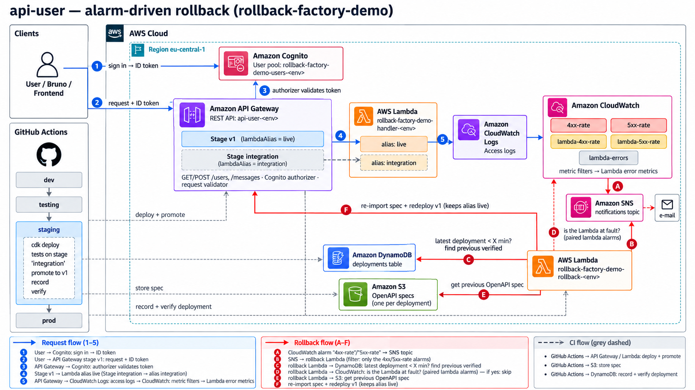

# Architecture

`rollback-factory-demo` shows automatic, alarm-driven rollbacks on AWS. Three projects are deployed
by GitHub Actions through `dev → testing → staging → prod`. Each one rolls itself back when its
CloudWatch alarm fires shortly after a deployment.

| Project | Rolls back by | Details |
|---|---|---|
| [API](#api-api-user-env) (`deploy-aws-api-gateway`) | re-importing the previous verified OpenAPI spec into stage `v1` | [README](deploy-aws-api-gateway/README.md), [story](deploy-aws-api-gateway/story-implementation.md) |
| [Lambda](#lambda-service-lambda-env) (`deploy-aws-lambda`) | pointing `live` back at the previous version that went live, restoring `$LATEST` from its archived zip | [README](deploy-aws-lambda/README.md) |
| [Frontend](#frontend-frontend-user-env) (`deploy-aws-cloudfront`) | pointing the CloudFront origin path back at the previous verified release | [README](deploy-aws-cloudfront/README.md), [story](deploy-aws-cloudfront/story-implementation.md) |

Shared conventions:

- **Naming:** the product names stay (`api-user-<env>`, `frontend-user-<env>`, `service-lambda-<env>`). Every other
  resource is `rollback-factory-demo-<resource>-<env>`.
- **Region:** the main region is `eu-central-1`. The frontend's alarms live in `us-east-1`, because
  CloudFront only publishes its metrics there.
- **Rollback rule:** only an alarm rollback in AWS (alarm → SNS → rollback Lambda) restores a
  previous version, and only to one that passed the integration tests ("verified"). The workflows
  never react to alarms.

## API (`api-user-<env>`)

The diagram was generated from [`deploy-aws-api-gateway/docs/architecture-diagram-prompt.md`](deploy-aws-api-gateway/docs/architecture-diagram-prompt.md).
The numbered arrows are the request flow, the lettered arrows the rollback, and the dashed arrows CI.

### Request flow (1–5)

1. **Sign in.** The client (a user, the Bruno collection, or the frontend) signs in to the Cognito
   user pool `rollback-factory-demo-users-<env>` and gets an ID token.
2. **Call the API.** It calls `GET`/`POST` on `/users` or `/messages` of the REST API `api-user-<env>`,
   stage `v1`, with the raw ID token in `Authorization`.
3. **Authorize and validate.** The Cognito authorizer checks the token. A request validator rejects
   `POST` bodies that aren't `{ "message": "..." }` with a 400 before they reach any code.
4. **Invoke the handler.** Each stage invokes its own alias of `rollback-factory-demo-handler-<env>`,
   named by its `lambdaAlias` stage variable.

   | Stage | `lambdaAlias` | Serves |
   |---|---|---|
   | `v1` | `live` | the promoted code, what clients use |
   | `integration` | `integration` | the code CI is testing |

   The console shows the integration as `…:${stageVariables.lambdaAlias}`. API Gateway resolves it on
   every request.
5. **Log and measure.** The stages write JSON access logs to `rollback-factory-demo-api-access-logs-<env>`.
   Metric filters count the 4xx/5xx responses that the Lambda itself produced (requests that reached
   it), which tells code errors apart from API Gateway errors.

### Alarms

| Alarm | Fires on | Effect |
|---|---|---|
| `rollback-factory-demo-api-user-4xx-rate-<env>` | > 25 % 4xx on stage `v1` | triggers a rollback |
| `rollback-factory-demo-api-user-5xx-rate-<env>` | > 5 % 5xx on stage `v1` | triggers a rollback |
| `rollback-factory-demo-lambda-4xx-rate-<env>` / `-lambda-5xx-rate-<env>` | the same rates, counting only errors the Lambda produced | blocks the rollback (the code is at fault, not the API config) |
| `rollback-factory-demo-lambda-errors-<env>` | Lambda invocation errors | notification only |

All of them fire in 2 of 3 one-minute periods. The rate alarms ignore minutes with too few requests,
so a few intentional errors from the integration tests can't trigger a rollback. They notify the SNS topic
`rollback-factory-demo-notifications-<env>`, which can also e-mail someone (`-c alarmEmail=...`).

### Rollback flow (A–F)

- **A.** The 4xx- or 5xx-rate alarm goes to `ALARM` and publishes to the SNS topic.
- **B.** The topic invokes `rollback-factory-demo-rollback-<env>`. A subscription filter only lets the
  two rate alarms through.
- **C.** The Lambda reads the deployments table. It only acts if the latest deployment is younger than
  `rollbackWindowMinutes` (default 30) and isn't itself a rollback. It picks the newest earlier
  deployment that is **verified** and was never rolled back.
- **D.** It checks whether the Lambda caused the errors: the paired `lambda-*` alarm is in `ALARM`, or
  the Lambda produced at least half of the errors. If so, it skips. An API rollback keeps the latest
  code, so it couldn't fix a code error.
- **E.** It claims the bad deployment, so the 4xx and 5xx alarms together roll back only once. Then it
  downloads the target's OpenAPI spec from S3.
- **F.** It re-imports the spec (`PutRestApi`, overwrite) and redeploys stage `v1`. The restored spec
  is re-pointed at the `live` alias, so it **restores the API configuration and keeps the latest
  promoted code**. The rollback is recorded as a new deployment.

### Deployment tracking

- **OpenAPI specs:** every deployment's spec is exported, with the API Gateway extensions so it can be
  re-imported, to `s3://rollback-factory-demo-<account>-deployments-<env>/api-user-<env>/<timestamp>/openapi.json`.
- **Deployments table:** `rollback-factory-demo-deployments-<env>` has one record per deployment, with
  `source` (`manual`, `cicd`, `rollback`, `restore`), actor, commit, CI run, `current`,
  `stable` / `stableFor`, `verifiedAt` and `rolledBackAt`.

### CI pipeline (dashed arrows)

[`api-gateway.yml`](.github/workflows/api-gateway.yml) runs on pull requests (typecheck, unit tests,
synth, a Bruno collection check). On `main` it deploys each environment in turn through
[`api-gateway-deploy.yml`](.github/workflows/api-gateway-deploy.yml):

1. `cdk deploy` to the **`integration` stage** only. Stage `v1` and the `live` alias are pinned to
   what they serve.
2. Integration tests against stage `integration`. If they fail, the job stops and `v1` was never touched.
3. Promote: stage `v1` → the tested deployment, alias `live` → the tested Lambda version.
4. Record the deployment (spec → S3, record → DynamoDB) and mark it verified.

`api-gateway-restore.yml` restores a chosen deployment by hand. `break-api-demo.yml` deploys a broken
branch to dev and sends traffic, to show an alarm rollback.

> **Note on the diagram:** it was drawn by an image model. Two arrows are only approximately right:
> - Arrow 5 starts at API Gateway (its access logs), not at the Lambda.
> - The CI arrows point at the right services, but their exact endpoints are approximate.
>
> The text above is the reference.

## Lambda (`service-lambda-<env>`)

No diagram yet: generate one from [`deploy-aws-lambda/docs/architecture-diagram-prompt.md`](deploy-aws-lambda/docs/architecture-diagram-prompt.md). In short:

- **Deploy:** `cdk deploy` publishes a new version to the `integration` alias while `live` stays
  pinned. CI invokes `service-lambda-<env>:integration` in the integration tests, and only then
  points `live` at the same version.
- **Archive:** a sync step in the rollback function archives every version: its zip goes to S3, its
  metadata to DynamoDB. The sync records the promotion, including the version's `liveAt`.
- **Rollback:** the errors alarm watches `live` and `$LATEST` only, never `integration`. Through SNS
  it invokes the rollback function. After its guards (deployment window, cooldown, consecutive-rollback
  limit), the function points `live` back at the newest older version that went live and was never
  rolled back from, and restores `$LATEST` from that version's zip. If only `$LATEST` is failing,
  it restores `$LATEST` alone.
- **Scheduled check:** every 5 minutes it syncs, marks long-healthy versions stable, and re-handles
  alarms still in `ALARM`.

See the [Lambda README](deploy-aws-lambda/README.md) for details.

## Frontend (`frontend-user-<env>`)

No diagram yet: generate one from [`deploy-aws-cloudfront/docs/architecture-diagram-prompt.md`](deploy-aws-cloudfront/docs/architecture-diagram-prompt.md). In short:

- **Hosting:** a simple Vite + TypeScript page is served by the CloudFront distribution `frontend-user-<env>`
  from a private S3 bucket, through Origin Access Control and HTTPS only. It shows the environment and
  the release it serves. Sign-in and calling the API are out of scope for now.
- **Releases:** each build is uploaded once to `releases/<yyyymmddThhmmssZ>/`, and its build manifest
  goes to S3. The distribution's **origin path** selects the live release.
- **Pipeline:** CI makes a release live on the integration distribution `frontend-user-<env>-integration`
  first and runs smoke and end-to-end tests there. Only if they pass does it switch `frontend-user-<env>`
  to the same release, like the API's `integration` stage.
- **Rollback:** the CloudFront 4xx/5xx-rate alarms live in `us-east-1`. Through SNS they invoke a
  rollback Lambda there, which points the origin path back at the previous verified release,
  invalidates the cache, and records the rollback in the deployments table in `eu-central-1`.

See the [frontend README](deploy-aws-cloudfront/README.md) for details.
