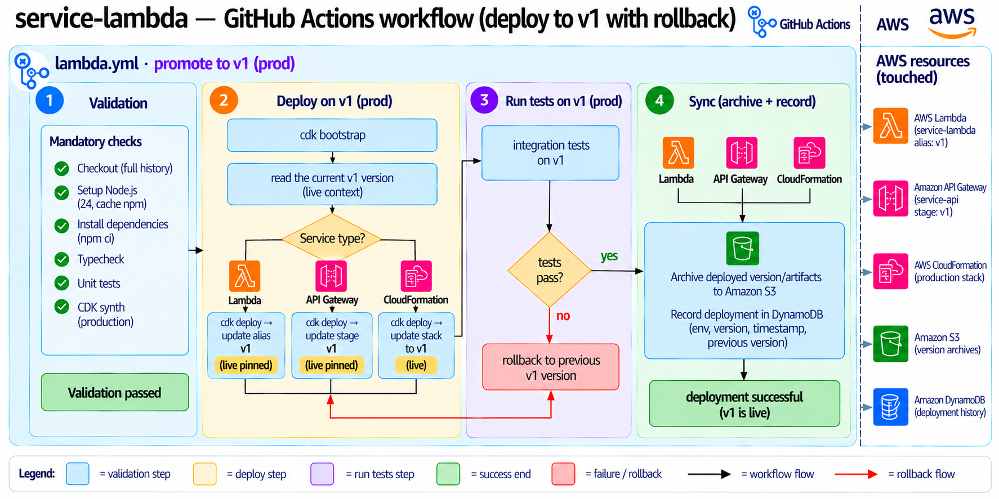
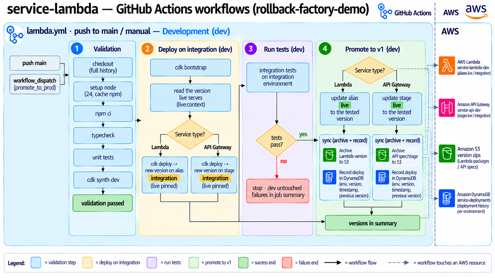
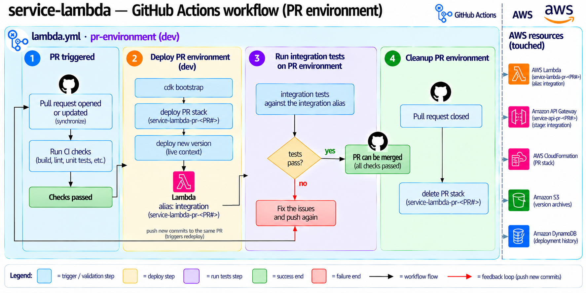

# rollback-factory-demo

## The why / what?

A deployment that passes every check can still break once clients use it. This repo shows how to
get back to a good version **automatically**, without someone reverting commits under pressure.

It deploys three kinds of AWS components with GitHub Actions through `dev → prod`, and keeps every
version it deploys so it can put one back:

| Project | What | Rolls back by | Docs |
|---|---|---|---|
| [`deploy-aws-api-gateway`](deploy-aws-api-gateway) | REST API `api-user-<env>` with a Cognito authorizer. One backend Lambda per resource (`/users`, `/messages`, `/orders`) | re-importing the previous verified OpenAPI export into stage `v1`; the routes keep calling each backend's `live` alias | [README](deploy-aws-api-gateway/README.md), [story](deploy-aws-api-gateway/story-implementation.md) |
| [`deploy-aws-lambda`](deploy-aws-lambda) | Lambda function `service-lambda-<env>` with `integration` and `live` aliases | pointing `live` back at the previous version that went live, and restoring `$LATEST` from its archived zip | [README](deploy-aws-lambda/README.md) |
| [`deploy-aws-cloudfront`](deploy-aws-cloudfront) | The React dashboard `frontend-user-<env>` on CloudFront, plus its API (a Lambda behind `/api/*`) | pointing the distribution's origin path back at the previous verified release | [README](deploy-aws-cloudfront/README.md), [story](deploy-aws-cloudfront/story-implementation.md), [tickets](deploy-aws-cloudfront/docs/README.md) |
| [`rollback-service`](rollback-service) | One Lambda per environment that every alarm goes to. It picks the API Gateway, CloudFront or Lambda manager from the alarm's name | (does the rollbacks above) | [README](rollback-service/README.md) |
| [`deploy-aws-dns`](deploy-aws-dns) | The hosted zone `rollback.ionuteliantudor.com` and the API domain `api.<env>.rollback.ionuteliantudor.com` | — | [README](deploy-aws-dns/README.md), [delegation](deploy-aws-dns/DELEGATION.md) |

There are two safety nets:

- **In CI:** a change is tested before or right after it reaches clients, and a failing test stops or reverts it.
- **In AWS:** when a CloudWatch alarm fires shortly after a deployment, alarm → SNS → the shared
  **rollback service** puts the previous good version back. No workflow is involved.

Every rollback, manual or automatic, can also be followed and triggered from the
[dashboard](deploy-aws-cloudfront/README.md) (https://dev.rollback.ionuteliantudor.com in dev,
https://rollback.ionuteliantudor.com in prod; sign-in is invite only).

## The how?

The workflows run the same four steps, **validate → deploy → test → sync**, in three places. The
diagrams use `service-lambda` as the example; the API (stage `v1`) and the CloudFormation stacks
follow the same shape. In the code, the Lambda alias the diagrams call `v1` is `live`.

### Option 1: deploy on the same stage, roll back on failure

Workflow: [`deploy-test-rollback`](.github/workflows/deploy-test-rollback.yml) (manual).

1. **Validation:** checkout, typecheck, unit tests, `cdk synth`.
2. **Deploy on v1:** the workflow reads the version that's live, then deploys the Lambda alias, the API stage or the CloudFormation stack straight to clients.
3. **Run tests on v1:** if the integration tests fail, it rolls back to the **latest stable** version:
   - **Lambda:** `live` and `integration` go back to the newest version marked `stable` in DynamoDB, and `$LATEST` is restored from its zip in S3.
   - **API Gateway:** the newest stable verified OpenAPI spec is re-imported from S3.
   - **CloudFormation:** the stack is updated back to the newest archived template that passed the tests.
4. **Sync:** on success, the version is archived to S3 and recorded in DynamoDB.

Fastest path, but clients can see the broken version until the rollback finishes.

### Option 2: deploy on an integration stage, then promote

Workflows: `lambda.yml`, `api-gateway.yml`, `frontend.yml` (push to `main` or manual), dev then prod.

1. **Validation:** the same checks.
2. **Deploy on integration:** the new version goes to the `integration` alias or stage (or the
   integration CloudFront distribution); what clients use stays pinned.
3. **Run tests on integration:** if they fail, the job stops and clients are never touched.
4. **Promote to v1:** the alias, stage or origin path moves to the tested version, and the
   deployment is archived and recorded.

This is the default pipeline. If something still breaks once it's live, the alarm-driven rollback
service takes over. To see that happen in dev, deploy one of the `demo/break-*` branches
(`demo/break-api-gateway`, `demo/break-lambda`, `demo/break-frontend`): each passes the
integration tests and only fails on live.

### Option 3: test on a PR environment before merging

Workflows: `lambda.yml` and `api-gateway.yml` on pull requests.

1. **Validation:** the same checks.
2. **Redeploy PR environment:** a copy of the stack, `pr-<number>`, is created or updated on
   every push (e.g. `service-lambda-pr-<number>`, and the API on
   `https://api.dev.rollback.ionuteliantudor.com/user-pr-<n>/v1/`).
3. **Run integration tests** against it. A failure shows on the PR, and the author fixes and pushes again.
4. **Ready to merge** once they pass.

The stacks are deleted when the tests finish, when the PR closes, or by the nightly
[`pr-environments-cleanup`](.github/workflows/pr-environments-cleanup.yml).

### More detail

- [`architecture/architecture.md`](architecture/architecture.md) and the per-resource diagrams in
  [`architecture/complex/images`](architecture/complex/images) (request flow, alarm-driven rollback, CI).
- Deploy steps are composite actions under [`.github/actions`](.github/actions).
- The manual [`cleanup`](.github/workflows/cleanup.yml) workflow destroys one environment's stacks
  (type `destroy <env>` to confirm). The DNS zone and API domains are never destroyed.

## Conclusion

| | Option 1: same stage | Option 2: integration stage | Option 3: PR environment |
|---|---|---|---|
| When it runs | manually | on `main`, per environment | on every PR push |
| Do clients see a failing version? | yes, until the rollback | no | no |
| What a failed test does | rolls back to the latest stable version | stops before promoting | blocks the merge |
| Cost | none extra | an integration alias/stage/distribution | a full stack per PR |

The options stack rather than compete: **option 3** catches problems before they merge,
**option 2** keeps untested code away from clients, and **option 1** covers the cases where the
only real test is on the live stage. Behind all three, the rollback service watches the alarms
and puts back the last good version on its own. Every version is archived (S3) and recorded
(DynamoDB), so there is always one to go back to.
