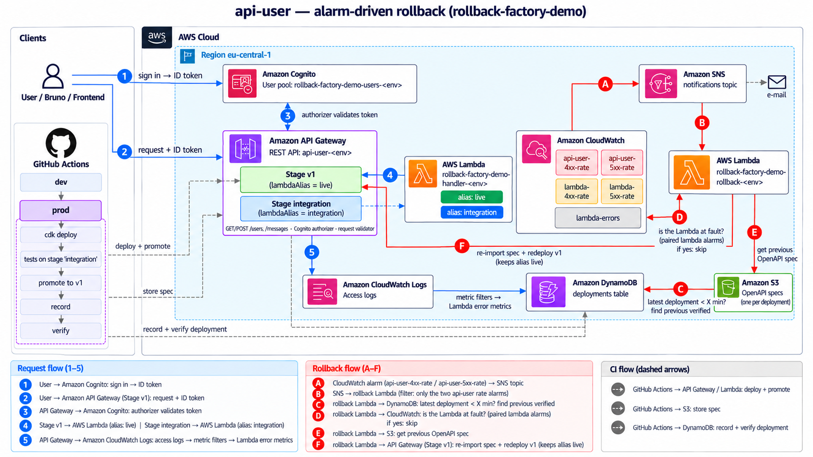
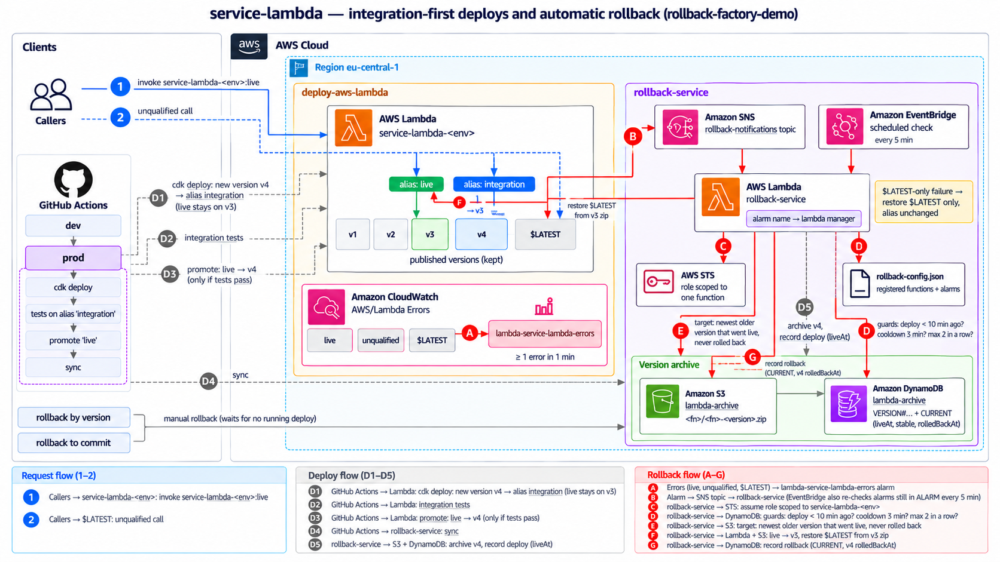
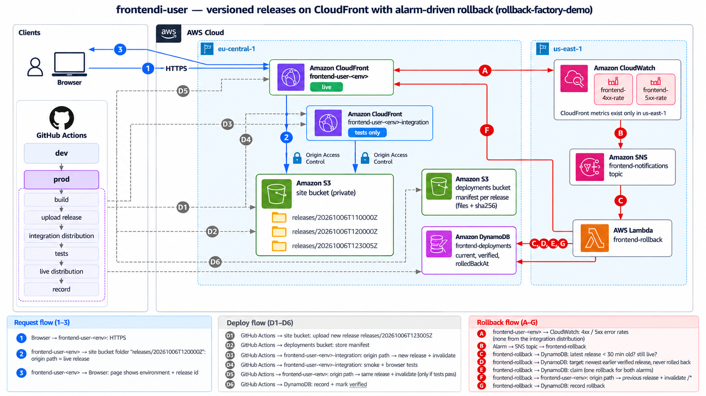
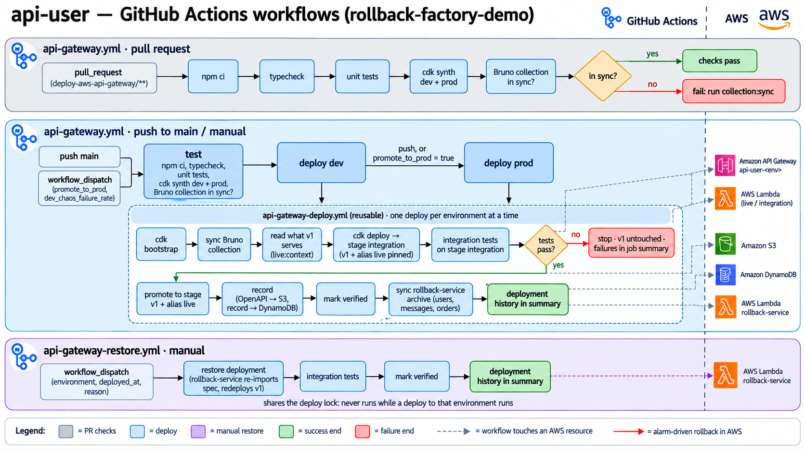
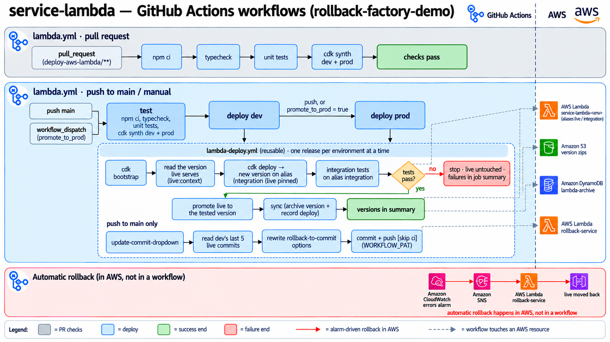

# rollback-factory-demo

Demos of automatic, alarm-driven rollbacks on AWS. Each project is deployed by GitHub Actions through
`dev → prod`. Every change is tested on an integration target (an API stage, a Lambda alias or a
second CloudFront distribution) before clients get it. When a CloudWatch alarm fires shortly after a
deployment, one shared **rollback service** puts the previous good version back.

| Project | What | Rolls back by | Docs |
|---|---|---|---|
| [`deploy-aws-api-gateway`](deploy-aws-api-gateway) | REST API `api-user-<env>` with a Cognito authorizer. One backend Lambda per resource (`/users`, `/messages`, `/orders`) | re-importing the previous verified OpenAPI export into stage `v1`; the routes keep calling each backend's `live` alias | [README](deploy-aws-api-gateway/README.md), [story](deploy-aws-api-gateway/story-implementation.md) |
| [`deploy-aws-lambda`](deploy-aws-lambda) | Lambda function `service-lambda-<env>` with `integration` and `live` aliases | pointing `live` back at the previous version that went live, and restoring `$LATEST` from its archived zip | [README](deploy-aws-lambda/README.md) |
| [`deploy-aws-cloudfront`](deploy-aws-cloudfront) | The React dashboard `frontend-user-<env>` on CloudFront, plus its API (a Lambda behind `/api/*`) | pointing the distribution's origin path back at the previous verified release | [README](deploy-aws-cloudfront/README.md), [story](deploy-aws-cloudfront/story-implementation.md), [tickets](deploy-aws-cloudfront/docs/README.md) |
| [`rollback-service`](rollback-service) | One Lambda per environment that every alarm goes to. It picks the API Gateway, CloudFront or Lambda manager from the alarm's name | (does the rollbacks above) | [README](rollback-service/README.md) |
| [`deploy-aws-dns`](deploy-aws-dns) | The hosted zone `rollback.ionuteliantudor.com`, shared by every environment's CloudFront sites, and the API domain `api.<env>.rollback.ionuteliantudor.com` every API is mapped on | — | [README](deploy-aws-dns/README.md), [delegation](deploy-aws-dns/DELEGATION.md) |

The sites are served on:

| Environment | Dashboard | Integration distribution (CI tests it first) |
|---|---|---|
| dev | https://dev.rollback.ionuteliantudor.com | https://dev-integration.rollback.ionuteliantudor.com |
| prod | https://rollback.ionuteliantudor.com | https://integration.rollback.ionuteliantudor.com |

The APIs are served on one domain per environment, as `<api path>/<stage>`:

| Environment | `api-user` (stage `v1`) | `api-user` (stage `integration`, CI tests it first) |
|---|---|---|
| dev | https://api.dev.rollback.ionuteliantudor.com/user/v1/users | https://api.dev.rollback.ionuteliantudor.com/user/integration/users |
| prod | https://api.rollback.ionuteliantudor.com/user/v1/users | https://api.rollback.ionuteliantudor.com/user/integration/users |

## Architecture

The diagrams below were generated by an image model from the prompts in
[`architecture/prompts`](architecture/prompts). They show the flows well, but a few drawn details lag
behind the code; the notes under each say which. The text in [`architecture/architecture.md`](architecture/architecture.md)
and each project's README are the reference.

Every diagram uses the same legend: **blue numbers** are the request flow, **red letters** the
alarm-driven rollback in AWS, and **grey dashed arrows (D1, D2…)** what CI does.

### API: `api-user-<env>`

1. Clients sign in to Cognito and call stage `v1` with the ID token.
2. The authorizer checks the token, and a request validator rejects bad bodies.
3. Each stage calls its own alias of the backend Lambdas: `v1` calls `live`, and `integration` calls `integration`.
4. When the 4xx or 5xx rate alarm fires, the rollback service runs these checks:
   - the latest deployment is recent;
   - the errors aren't the Lambda's fault, judged from the paired Lambda alarms.

   It then re-imports the newest earlier **verified** OpenAPI export from S3 and redeploys `v1`.
   The routes keep calling each backend's `live` alias, so the code isn't rolled back.

Where the drawing is behind the code:
- One backend is drawn, `rollback-factory-demo-handler-<env>`. There is now one per resource.
- The rollback Lambda is drawn as `rollback-factory-demo-rollback-<env>`. It is now the shared `rollback-factory-demo-rollback-service-<env>`.

Earlier version of this diagram (pipeline dev → testing → staging → prod)

### Lambda: `service-lambda-<env>`

1. `cdk deploy` publishes a new version to the `integration` alias, while `live` stays where it is.
2. The integration tests call `integration`. Only if they pass does `live` move to the new version.
3. The rollback service archives every version: the zip goes to S3 and the metadata to DynamoDB, including `liveAt`, `stable` and `rolledBackAt`.
4. The errors alarm watches `live`, unqualified calls and `$LATEST`. When it fires, the rollback service runs its guards:
   - the deployment window;
   - the cooldown;
   - the limit on consecutive rollbacks.

   It then points `live` back at the newest older version that went live and restores `$LATEST` from that version's zip.
5. Every 5 minutes, an EventBridge check re-handles alarms still in `ALARM` and marks long-healthy versions **stable**. The dashboard's "Redeploy from S3" only offers stable versions.

### Frontend: `frontend-user-<env>`

1. Each build is uploaded once to `releases/<timestamp>/` in the private site bucket, with its manifest in the deployments bucket.
2. The distribution's **origin path** selects the live release.
3. CI makes a release live on the integration distribution first and runs the smoke and browser tests there. Only if they pass does `frontend-user-<env>` switch to the same release.
4. The CloudFront 4xx/5xx rate alarms live in `us-east-1`, because CloudFront only publishes its metrics there. Through SNS they reach the rollback service, which:
   - points the origin path back at the previous verified release;
   - invalidates the cache;
   - records the rollback.

Where the drawing is behind the code:
- The rollback Lambda is drawn as a separate `frontend-rollback`. It is now the shared rollback service.
- The page is now the React dashboard, with its API at `/api/*`.

### GitHub Actions workflows

- **Pull requests:** each project's workflow runs the typecheck, unit tests and `cdk synth`. For the
  API and the Lambda, the PR then gets **its own environment**, `pr-<number>`: a copy of the stack
  (`deploy-aws-api-gateway-pr-<n>`, `deploy-aws-lambda-pr-<n>`) that is deployed on every push, and
  the integration tests run on it. The PR's API is also on
  `https://api.dev.rollback.ionuteliantudor.com/user-pr-<n>/v1/` while they run. Once the tests are
  done, the job deletes the stacks. Closing the PR deletes them too, and the nightly [`pr-environments-cleanup`](.github/workflows/pr-environments-cleanup.yml) deletes
  any left behind.
- **`main` (or a manual run):** it deploys dev, then prod. One environment at a time, a job:
  1. deploys to the integration target;
  2. runs the integration tests there;
  3. promotes the change to clients, only if the tests pass;
  4. records and verifies the deployment.

  If the tests fail, what clients use is never touched.
- **The deploy steps:** they live in composite actions under [`.github/actions`](.github/actions):
  - `api-gateway-deploy`
  - `frontend-deploy`
  - `lambda-deploy`
  - `rollback-service-deploy`

  The diagrams still call them reusable workflows (`*-deploy.yml`); they became actions after the diagrams were drawn.
- **No workflow rolls back on an alarm.** That happens only in AWS: alarm → SNS → rollback service.
- **[`deploy-test-rollback`](.github/workflows/deploy-test-rollback.yml) (manual):** it deploys one component straight to
  clients, tests it there, and rolls back to the **latest stable** version if the tests fail:
  - **API Gateway:** stage `v1` gets the new config. On a failure, the newest stable verified OpenAPI spec is re-imported from S3, still calling the `live` aliases.
  - **Lambda:** `live` gets the new version. On a failure, `live` and `integration` go back to the newest version marked
    `stable` in the DynamoDB archive, and `$LATEST` is restored from its zip in S3.
  - **CloudFormation:** this covers the whole `deploy-aws-api-gateway-<env>` or `deploy-aws-lambda-<env>` stack. Each
    deployed template is archived in `rollback-service`'s `stack-templates` bucket and table, and a failure updates the stack back to the newest
    template that passed the tests.

## The dashboard

`frontend-user-<env>` is a React dashboard with three widgets. **Sign-in is invite only**: each
environment has its own Cognito user pool with no sign-up, and an administrator invites each user
(`npm run users -- --env <env> --action invite --email <address>` in `deploy-aws-cloudfront`). Signed out,
the page shows only the sign-in form, and the dashboard API answers 401. See
[Sign-in](deploy-aws-cloudfront/README.md#sign-in-invite-only).

- **API Gateways:**
  - the stages, with the OpenAPI export each one serves;
  - the recorded deployments;
  - a stage **Rollback** menu listing verified OpenAPI exports. The confirm dialog shows the live Lambda versions the API will run.
- **Lambda functions:** the functions registered for rollback, each with:
  - its versions, with a **Stable** column;
  - its aliases, including where `live` points (`live:N`);
  - menus to point an alias at a version. `live` only moves to stable versions;
  - **Redeploy from S3** for stable archived versions.
- **CloudFront distributions:** the release history, configuration, invalidations and monitoring, with a **Restore** action.

Every change goes through the rollback service. It returns an operation id, and the page shows a
confirm dialog, then a progress popup with the run's logs and an ETA.

## Demos

To see an alarm-driven rollback in dev, deploy one of the `demo/break-*` branches with its normal
workflow (`gh workflow run <workflow> --ref <branch>`). Each break passes the integration tests and
only fails once it's live:

| Branch | What breaks on live | Rolled back by |
|---|---|---|
| `demo/break-api-gateway` | stage `v1` resolves every route to a Lambda without an alias: 500s | the API Gateway manager (previous verified OpenAPI export) |
| `demo/break-lambda` | calls through `service-lambda-dev:live` throw | the Lambda manager (`live` → previous version) |
| `demo/break-frontend` | the live site keeps requesting a missing file: 403s | the CloudFront manager (previous verified release) |

These branches are kept in sync with `main` and are never merged. The manual workflows
`break-api-demo` and `break-frontend-demo` also deploy something broken and send traffic until the
rollback happens.

## Cleanup

The manual workflow [`cleanup`](.github/workflows/cleanup.yml) destroys the stacks of one
environment, for all projects or one of them:

- **Confirming:** type `destroy <env>`.
- **Waiting:** it waits for any deploy or rollback of that environment to finish.
- **Left behind in prod:** buckets, tables and the user pool survive their stacks. Delete them by hand before deploying prod again.
- **Never destroyed:** the DNS zone and the API domains (`deploy-aws-dns`); an API stack takes only its mappings with it. Destroy the frontend before you ever delete the zone, or the frontend stack can't remove its records ([DELEGATION.md](deploy-aws-dns/DELEGATION.md#teardown-order)).
